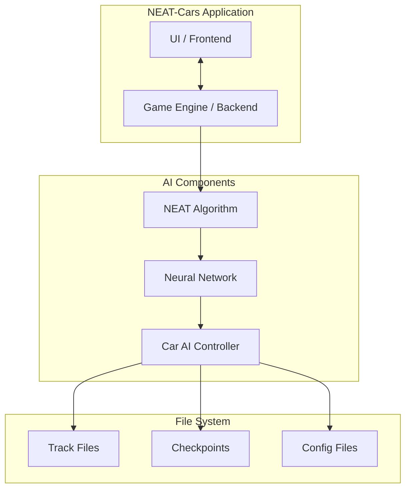
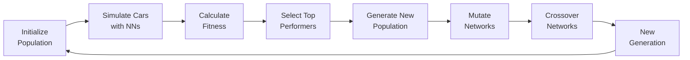
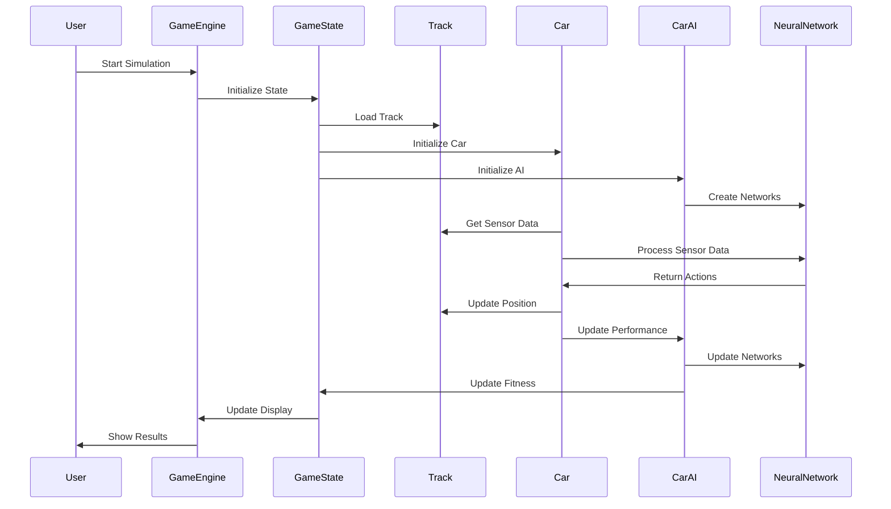
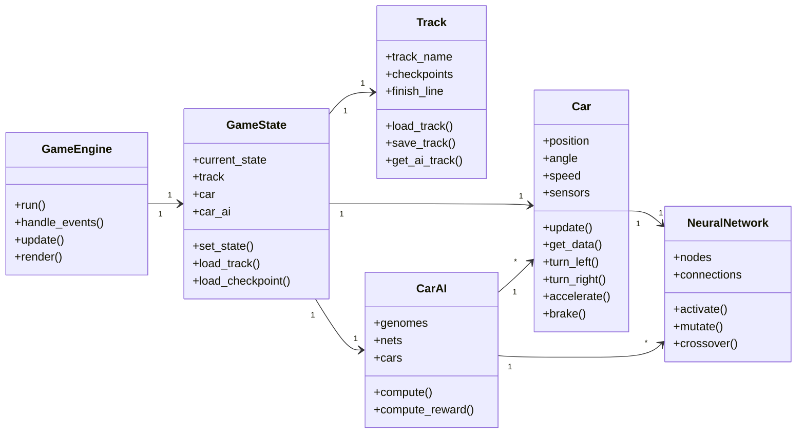
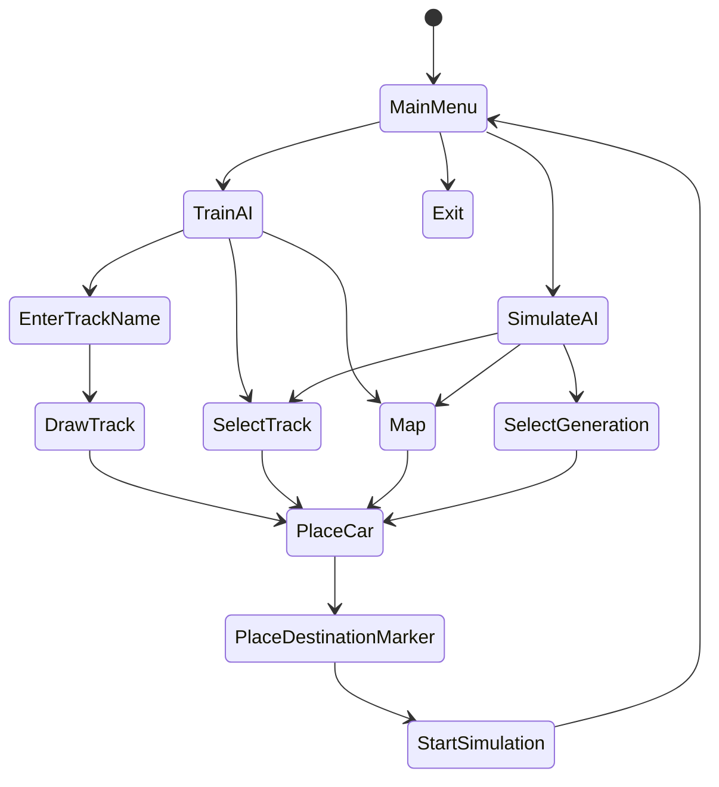
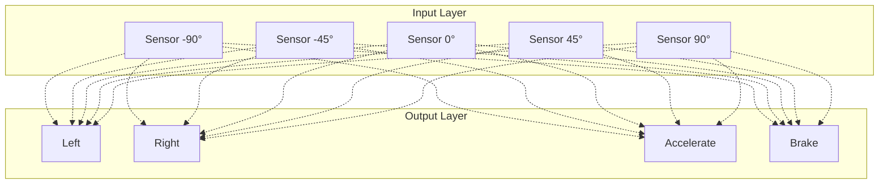

# NEAT-Cars Architecture Diagrams

## System Architecture Diagram

## NEAT Overview

## Sequence Diagram

## Component Relationships

## State Flow Diagram

## Neural Network Structure

These diagrams provide a comprehensive view of the NEAT-Cars system architecture, including:

- System overview with component relationships
- Detailed sequence of operations
- Class relationships and responsibilities
- State flow through the application
- Neural network structure and connections
